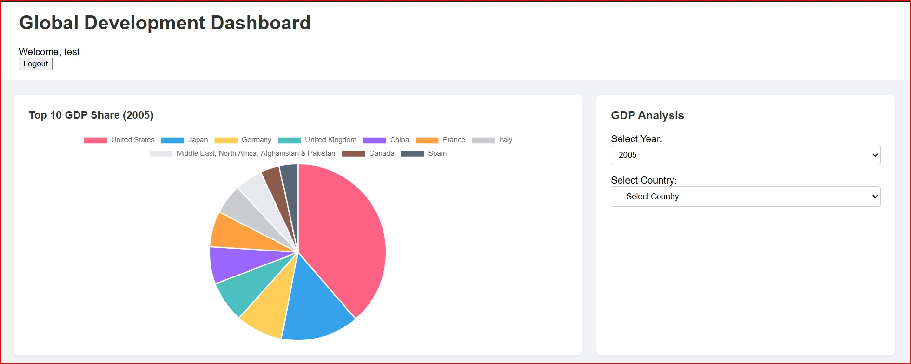

# Global Development Data Dashboard

A full-stack web application that visualizes economic and demographic data from the World Bank. The project features a secure Django backend serving a REST API to an interactive, dynamic JavaScript frontend.

**Live URL:** [https://deepq-dashboard-task.onrender.com](https://deepq-dashboard-task.onrender.com)
*(Note: This might take some time to load as the server closes the instance incase of inactivity and takes few seconds to restart due to the plan limitations on render.)*

---

## Demo


---

## Features
- **User Authentication:** Secure user registration, login, and logout functionality.
- **Interactive Dashboard:** A multi-chart dashboard built with Chart.js.
- **Dynamic Filtering:** Users can filter data by country and year, with charts updating in real-time.
- **Conditional Chart Rendering:** The main GDP chart dynamically switches between a pie chart for multi-country comparison and a bar chart for a single country's time-series trend.
- **Robust Data Pipeline:** A backend management command uses the Pandas library to clean, transform, and load raw World Bank CSV data into the database.
- **REST API:** A RESTful API built with Django REST Framework serves the cleaned data to the frontend.

---

## Architecture Overview

This application follows a traditional client-server architecture:

-   **Backend (Server):** A monolithic Django application handles all business logic, database interactions, and user authentication. It exposes a single REST API endpoint via Django REST Framework to provide data to the client.
-   **Frontend (Client):** A dynamic single-page dashboard built with vanilla JavaScript. It is rendered by a Django template but all subsequent data loading and chart rendering is handled client-side by making asynchronous calls to the backend API.
-   **Database:** The application is configured with `dj-database-url` to use SQLite for local development and a robust PostgreSQL database in production.

---

## API Endpoints

The backend provides a RESTful API to access the cleaned World Bank data. Authentication is required for all endpoints.

### Main Data Endpoint

-   **Endpoint:** `GET /api/v1/data/`
-   **Description:** Retrieves a list of data points.
-   **Authentication:** Required (user must be logged in).
-   **Query Parameters:**
    -   `country=<country_name>`: Filter by a specific country (e.g., `?country=India`).
    -   `series=<series_name>`: Filter by a specific data series (e.g., `?series=Population, total`).
    -   `year=<year>`: Filter by a specific year (e.g., `?year=2022`).
-   **Sample Response:**
    ```json
    [
        {
            "id": 1,
            "country": "India",
            "series": "Population, total",
            "year": 2022,
            "value": 1417173173.0
        }
    ]
    ```

### Authentication Endpoints
-   `/signup/`: Renders the user registration page.
-   `/login/`: Renders the login page and handles user login.
-   `/logout/`: Logs the current user out.
-   `/admin/`: The Django admin interface.

---

## Tech Stack
- **Backend:** Django, Django REST Framework, Gunicorn
- **Frontend:** HTML, CSS, Vanilla JavaScript, Chart.js
- **Database:** PostgreSQL (Production), SQLite3 (Development)
- **Data Processing:** Pandas
- **Deployment:** Render

---
## Local Setup Instructions

1.  **Clone the Repository:**
    ```bash
    git clone https://github.com/1av22/django-dashboard-project.git
    cd django-dashboard-project
    ```
2.  **Environment Variables:**
    - This project uses an `.env` file for local environment variables. Copy the example file:
      ```bash
      cp .env.example .env
      ```
    - Open the `.env` file and set your own `SECRET_KEY`.

3.  **Create and Activate a Virtual Environment:**
    ```bash
    python -m venv venv
    source venv/bin/activate  # On Windows, use `venv\Scripts\activate`
    ```
4.  **Install Dependencies:**
    ```bash
    pip install -r requirements.txt
    ```
5.  **Set Up the Database:**
    - The project will use `db.sqlite3` for local development automatically.
    ```bash
    python manage.py migrate
    ```
6.  **Load the World Bank Data:**
    *(Note: The necessary `final_data.csv` file is included in the `/data/` directory of this repository.)*
    ```bash
    python manage.py seed_data
    ```
7.  **Create a Superuser:**
    ```bash
    python manage.py createsuperuser
    ```
8.  **Run the Development Server:**
    ```bash
    python manage.py runserver
    ```
    The application will be available at `http://127.0.0.1:8000/`.

---

## Probable Issues & Troubleshooting

-   **Data Seeding Fails:** The `python manage.py seed_data` command will fail if the required `final_data.csv` is not present in the `/data/` directory. Ensure the file is correctly named and placed before running the script.
-   **Static Files (CSS/JS) Not Loading Locally:** If the styles or scripts don't load during local development, ensure `DEBUG = True` is set in your `.env` file.
-   **`ALLOWED_HOSTS` Error on Deployed Site:** A `400 Bad Request` error on the live site means you have not added the live URL to the `ALLOWED_HOSTS` list in `settings.py` and as an environment variable on your hosting provider.

---

## Test User Credentials

To test the live application without registering, you can use the following credentials:

- **Username:** `test`
- **Password:** `testpassword123`

*(Note: This user was created using the application's built-in signup form.)*